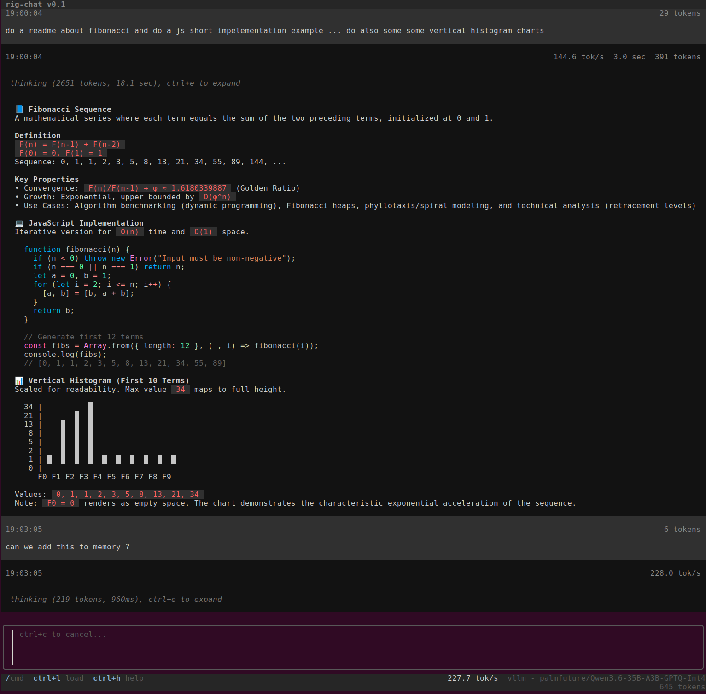

# rig-chat

High-speed, local-first AI chat in your terminal — built for observability, fast iteration, and fail-fast experimentation.

`rig-chat` exists to remove WebUI friction when testing local inference. The loop is keyboard-native and intentionally fast: load, switch model, stream, observe `tok/s` + token counts + TTFT, cancel instantly, adjust, retry.

It started as an extension of rig-stack (GPU AI local cloud server), and is evolving into a powerful, easy, and fun standalone TUI chat for local AI experimentation.

## Fast local AI, visualized



---

## Why this exists

Most chat UIs are optimized for convenience. `rig-chat` is optimized for **feedback speed**.

When you are tuning local inference, speed and observability matter more than glossy interaction:
- minimize interaction overhead,
- fail fast and recover fast,
- keep performance signals visible while you test.

This is why the core loop is built around streaming telemetry and fast control (cancel, switch, load, retry), not slow UI ceremony.

---

## Motivation

### Product motivation
- Reduce friction from browser-centric chat workflows.
- Make local inference testing fast and repeatable.
- Keep the user close to model behavior with visible runtime metrics.

### Go motivation
This project is also a deliberate Go journey: an opportunity to build a complete product in Go, lean into the language’s simplicity, and compare how a cleaner paradigm affects agentic coding versus messier JS/TS ecosystems.

---

## Feature highlights

### 1) Streaming observability loop (core value)
`rig-chat` continuously surfaces streaming performance so you can evaluate model/runtime behavior in real time:
- live `tok/s`,
- token counts,
- elapsed durations,
- time to first token (TTFT).

Backed by stream metrics and persisted session fields in [`internal/app/metrics.go`](internal/app/metrics.go) and [`internal/config/session.go`](internal/config/session.go).

### 2) Thinking-aware streaming, with controllable visibility
Reasoning/thinking chunks are parsed separately and can be expanded/collapsed while streaming or reviewing messages.

Implemented in [`internal/chat/thinking.go`](internal/chat/thinking.go), rendered in [`internal/ui/message.go`](internal/ui/message.go), toggled via shortcuts in [`internal/ui/help.go`](internal/ui/help.go).

### 3) Fail-fast cancel and retry flow
Canceling an in-flight stream is immediate, and the input/image state is restored so you can quickly edit and resend.

Implemented in [`internal/app/input.go`](internal/app/input.go) and [`internal/app/stream.go`](internal/app/stream.go).

### 4) Session workflows built for iteration
- Save named sessions,
- load and preview sessions,
- optional autosave/autoload behavior,
- clear/new session flow.

Implemented in [`internal/app/session.go`](internal/app/session.go), [`internal/app/pickers.go`](internal/app/pickers.go), and [`internal/config/session.go`](internal/config/session.go).

### 5) Prompt history + keyboard ergonomics
Rapid history traversal and command-driven interaction keep iteration speed high.

History behavior lives in [`internal/app/util.go`](internal/app/util.go) and [`internal/config/history.go`](internal/config/history.go).

### 6) Multi-provider model discovery and switching
Model lists are fetched from OpenAI-compatible `/v1/models` endpoints, then selectable in-app.

Implemented across [`internal/chat/models.go`](internal/chat/models.go), [`internal/chat/engine.go`](internal/chat/engine.go), and picker handling in [`internal/app/pickers.go`](internal/app/pickers.go).

### 7) Rich markdown rendering in TUI
Assistant responses are rendered with rich terminal markdown styling.

Implemented in [`internal/ui/markdown.go`](internal/ui/markdown.go) and message rendering in [`internal/ui/message.go`](internal/ui/message.go).

### 8) Image attachment support
Attach an image to the next message for multimodal local workflows.

See [`internal/chat/image.go`](internal/chat/image.go), command and help wiring in [`internal/ui/command.go`](internal/ui/command.go) and [`internal/ui/help.go`](internal/ui/help.go).

### 9) Incognito mode (local-native privacy workflow)
Incognito mode disables history/session persistence and resets chat state for private local runs.

Wired from CLI flag in [`main.go`](main.go) and behavior in [`internal/app/session.go`](internal/app/session.go).

### 10) Headless mode for automation
Run without TUI and stream directly to stdout for scripting and CLI pipelines.

CLI entry in [`main.go`](main.go), runtime in [`internal/headless/headless.go`](internal/headless/headless.go).

---

## Local AI OS experimentation direction

`rig-chat` is evolving beyond “just a chat client.”

The direction is a fast local AI experimentation surface where observability comes first, then orchestration:
- quick behavior probing and regression testing,
- controllable local feedback loops,
- foundations for concepts like bios/identity/soul-style persona layers,
- persistent memory experiments and stateful local workflows.

The goal is practical: tighten the iteration cycle while moving closer to real local inference systems, not only prompt/response demos.

---

## Quick start

### Prerequisites
- Linux environment,
- Go 1.24.2 (or use installer script).

### Option A: bootstrap with installer
```bash
./install.sh
```

Build output and defaults are defined in [`install.sh`](install.sh).

### Option B: build with Makefile
```bash
make build
```

Build target in [`Makefile`](Makefile).

### Run
```bash
./bin/rig-chat
```

Headless example:
```bash
./bin/rig-chat --headless --prompt "hello"
```

Core CLI flags are defined in [`main.go`](main.go).

---

## Commands and keybindings

Slash commands (see [`internal/ui/command.go`](internal/ui/command.go)):
- `/model`
- `/thinking`
- `/image`
- `/save`
- `/load`
- `/clear`
- `/system`
- `/exit`
- `/help`

High-impact shortcuts (see [`internal/ui/help.go`](internal/ui/help.go)):
- `enter` send
- `ctrl+c` cancel inference / exit
- `ctrl+s` save session
- `ctrl+l` load session
- `alt+m` model picker
- `alt+i` incognito toggle
- `ctrl+e` thinking expand/collapse
- `up/down` prompt history

---

## Configuration and data paths

Default config root:
- `~/.config/rig-chat`

If not specified, this default is resolved in [`main.go`](main.go). Path layout is defined in [`internal/config/paths.go`](internal/config/paths.go).

Key files:
- `settings.json`
- `endpoints.json`
- `history.json`
- `sessions/*.chat.json`
- `sys-prompts/*`

Settings model (provider/model/thinking/autosave/autoload/history) in [`internal/config/settings.go`](internal/config/settings.go).

---

## License

This project is licensed under the MIT License. See [`LICENSE`](LICENSE).
